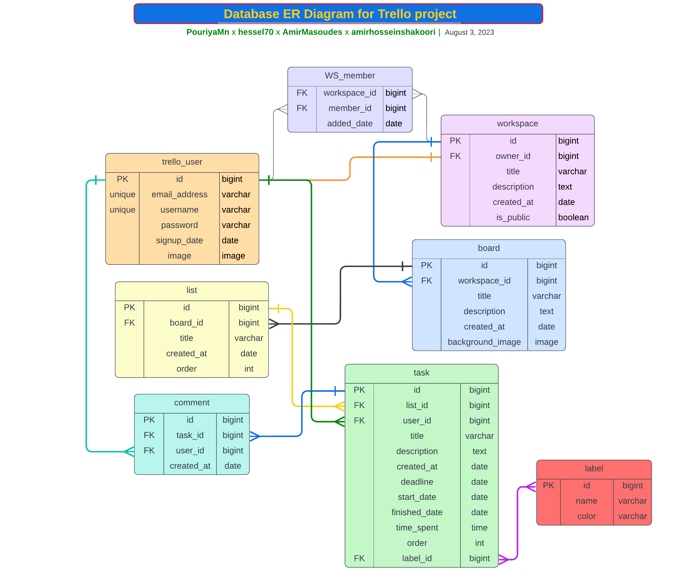

# Trello
### This is the  third project in Daneshkar Bootcamp, which aims to create _Trello_ clone  

And it is being done in collaboration with these following developers:  
**_Hesel Gharehbaai_** [@hesel70](https://github.com/hesel70)  
**_Pouriya MohammadNejad_** [@PouriyaMn](https://github.com/PouriyaMn)  
**_AmirHosein Shakoori_** [@amirhosseinshakoori](https://github.com/amirhosseinshakoori)  
**_AmirMasoud Eslamzadeh_** [@AmirMasoudes](https://github.com/AmirMasoudes)

------------------------------------
### the prototypes of **_Trello_** project:

------------------------------------
### the initial ERD of project:

------------------------------------

### Installation
Clone the repository:  
Visit [**GitHub Repository**](https://github.com/hesel70/Trello.git)  
or  
Copy the [**_SSH Key_**](git@github.com:hesel70/Trello.git)  

------------------------------------

## Create a virtual environment and activate it:  
> ## for linux:
> 1. create:  
>
>        python3 -m venv env  
> 2. activate:
>
>        source env/bin/activate

> ## for windows:
> 1. create:
>
>        python -m venv env
>
> 2. activate:
>
>        env/Scripts/activate
>
-------------------------

### Install the dependencies:  
    pip install -r requirements.txt

-------------------------

### Set up the database:
    python manage.py migrate

### Create a superuser:  
    python manage.py createsuperuser

### Run the development server:
    python manage.py runserver

Open your web browser and go to:  
**http://127.0.0.1:8000**  
to see the website.

------

## License:  
This project is licensed under the MIT License👌🏻.

---
